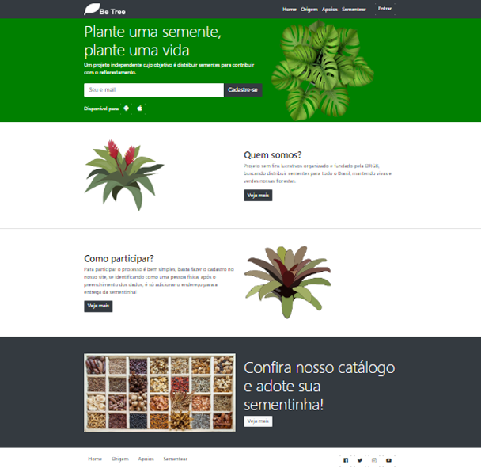

<h3 align="center">Bee Tree</h3>

   Front-end project
     
     
     
    
    
 ## Build with
* [Bootstrap](https://getbootstrap.com)
* [HTML](https://html.com)
* [CSS](https://css.com)

## Usage
Front-end project. The landing page was based in a organization that distributes seeds around the country, contributing to reforestation, all that free.

## Architecture:
* [Header]
* [Home]
* [Two sections about the program]
* [One section to show the catalog]
* [Footer]

## Getting Started

git clone https://github.com/SthefanneBatista/Front-end_BeeTree
